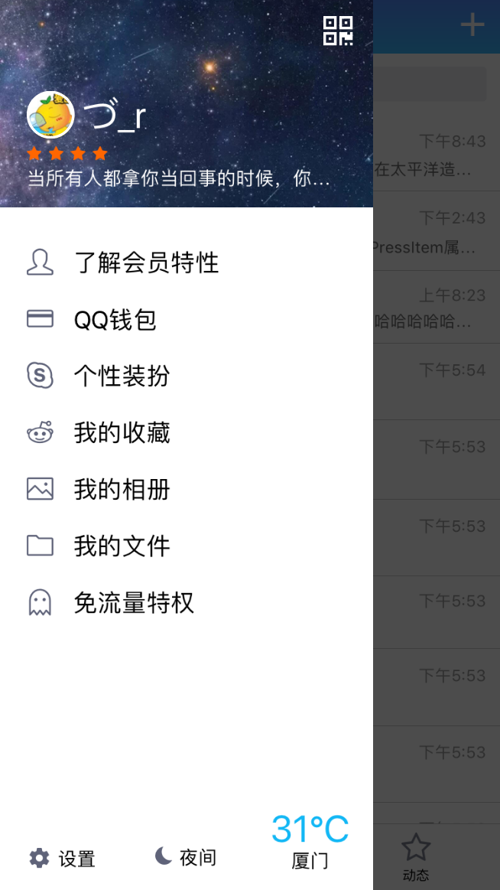

# react-native-qq

升级到0.55版本。

> 主要在iphone下测试，android未详细测。

## 页面

- 登陆页


- 首页





- 聊天页


- 个人详细页


## 启动

```
git clone https://github.com/liaoyongfu/react-native-qq.git
cd react-native-qq
yarn
react-native run-ios
```

> 注意：新版本xcode版本要`>=8`，不然会报错。